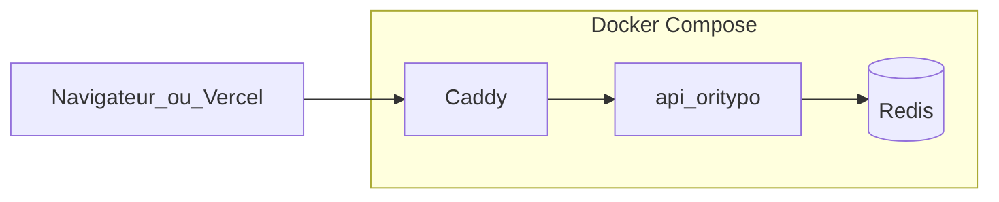

# Outils Ori (origami) — catalogue complet

Chaque outil a un **nom public** et une **responsabilité** claire. Le code est **réutilisable** (open source) ; **Oriradar.com** ajoute auth, plans payants et UI.

## Philosophie

| Principe | Détail |
|----------|--------|
| **Open source** | Licences permissives (MIT / Apache selon les crates). |
| **Composable** | Contrats stables (JSON, CLI) entre Rust et Python. |
| **Oriradar** | Facturation, quotas, dashboard — hors des libs moteur. |

## Périmètre officiel de la suite Ori

La **suite officielle** à open sourcer et à exploiter dans **Oriradar** est composée des briques ci-dessous.

| Dossier | Rôle | Outil Ori | Intégration |
|---------|------|-----------|-------------|
| [`backend/oritypo_solver/`](../backend/oritypo_solver/) | API HTTP FastAPI, orchestration des scans | **oritypo-solver** | Conteneurs `api` et `worker` ; l’API publie les jobs, le worker les exécute. |
| [`crates/orifold/`](../crates/orifold/) | Génération de permutations de domaines | **orifold** | Binaire `orifold` dans l’image Docker `api` ; JSON lines consommées par [`permutations.py`](../backend/oritypo_solver/services/permutations.py). |
| [`crates/oriseek/`](../crates/oriseek/) | Résolution DNS batch concurrente | **oriseek** | Binaire `oriseek` dans l’image Docker ; JSON lines consommées par [`dns_resolve.py`](../backend/oritypo_solver/services/dns_resolve.py). |
| [`deploy/`](../deploy/) | Déploiement Compose de référence | stack Ori | **Caddy** → **api** → **Redis** ← **worker** ; même philosophie d’installation qu’une stack ail sur VPS. |

## Catalogue complet

Chaque ligne est un **produit logique** (lib, module ou service). Au début, plusieurs outils vivent **dans le même conteneur API** ; on les **scinde** en services séparés si la charge ou les dépendances lourdes l’exigent (ex. navigateur headless).

| Outil | Rôle | Stack typique | Déploiement cible |
|-------|------|----------------|-------------------|
| **oritypo-solver** | API HTTP : création de scans, statut, agrégation des résultats, orchestration. | Python (FastAPI) | Conteneur **`api`** (obligatoire) |
| **orifold** | Génération de permutations (variantes) à grande échelle. | Rust (crate / CLI) | Binaire dans l’image **`api`** ou sidecar ; worker dédié si besoin |
| **oriseek** | Résolution DNS (A/AAAA/MX/NS/CNAME), timeouts, parallélisme, batchs. | Rust (CLI) + adaptateur Python | Binaire dans l’image **`api`** / **`worker`** ; **service** séparé si volumétrie extrême |
| **oriprobe** | Couche HTTP : statut, redirections, titre, en-têtes. | Python (httpx) | Module puis **worker** si scans longs |
| **orirdap** | WHOIS / RDAP avec cache et rate-limit par TLD. | Python | Module + cache **Redis** |
| **oriscore** | Règles de risque / priorité (scores, seuils, raisons). | Python | Bibliothèque appelée après DNS / HTTP |
| **oriframe** | Captures d’écran (headless) — coûteux. | Python + Playwright ou service externe | **Worker** séparé + file |
| **oridigest** | Digest journalier (plans payants), agrégats, file d’envoi. | Python worker + scheduler | Conteneur **`worker`** + Redis |
| **oricert** | Découverte de typosquats via Certificate Transparency (logs publics TLS). | Python (httpx + crt.sh) | Module appelé en début de scan, fusionné aux variantes orifold |
| **oristream** (optionnel) | Webhooks / événements (Slack, SIEM). | Python | Module API ou petit worker |

### Légende des noms

| Nom | Idée |
|-----|------|
| **oritypo-solver** | Résoudre le puzzle des fautes de frappe / homoglyphes. |
| **orifold** | Pliures = transformations du nom (origami). |
| **oriseek** | Chercher les enregistrements DNS. |
| **oriprobe** | Sonder la couche HTTP. |
| **orirdap** | Registres (RDAP). |
| **oriscore** | Noter le risque. |
| **oriframe** | Cadre / capture de page. |
| **oridigest** | Synthèse périodique. |
| **oricert** | Certificat — découverte par les logs Certificate Transparency. |
| **oristream** | Flux d’événements sortants. |

### Chaîne implémentée aujourd’hui

1. **oritypo-solver** — [`backend/oritypo_solver/`](../backend/oritypo_solver/) : API + orchestration des scans.
2. **orifold** — [`crates/orifold/`](../crates/orifold/) : permutations via une CLI `orifold enumerate` (JSON lines) ; moteur Rust autonome utilisé par défaut dans Docker (`ORIFOLD_PATH`). Sans binaire, repli sur l’heuristique Python dans [`permutations.py`](../backend/oritypo_solver/services/permutations.py).
3. **oriseek** — [`crates/oriseek/`](../crates/oriseek/) + [`backend/oritypo_solver/services/dns_resolve.py`](../backend/oritypo_solver/services/dns_resolve.py) : enregistrements **A / AAAA / MX / NS / CNAME** via batch Rust, avec repli Python si nécessaire.
4. **oriprobe** — [`backend/oritypo_solver/services/http_probe.py`](../backend/oritypo_solver/services/http_probe.py) : test HTTPS/HTTP, redirections, serveur, titre HTML.
5. **oriscore** — [`backend/oritypo_solver/services/scoring.py`](../backend/oritypo_solver/services/scoring.py) : score de risque, score prédictif, niveaux et raisons. Documentation détaillée : [`docs/scoring.md`](scoring.md).
6. **orirdap** — [`backend/oritypo_solver/services/rdap_lookup.py`](../backend/oritypo_solver/services/rdap_lookup.py) : lookup RDAP optionnel (`ORI_ENABLE_RDAP=1`) pour enrichir les domaines enregistrés.
7. **oriframe** — [`backend/oritypo_solver/oriframe_worker.py`](../backend/oritypo_solver/oriframe_worker.py) + [`backend/oritypo_solver/services/oriframe.py`](../backend/oritypo_solver/services/oriframe.py) : captures d’écran conditionnelles via navigateur headless Playwright.
8. **oricrawl** — [`backend/oritypo_solver/oricrawl_worker.py`](../backend/oritypo_solver/oricrawl_worker.py) + [`backend/oritypo_solver/services/oricrawl.py`](../backend/oritypo_solver/services/oricrawl.py) : crawl léger multi-pages pour formulaires, login, paiement et signaux de contenu.
9. **oridigest** — [`backend/oritypo_solver/oridigest_worker.py`](../backend/oritypo_solver/oridigest_worker.py) + [`backend/oritypo_solver/services/oridigest.py`](../backend/oritypo_solver/services/oridigest.py) : digest planifié / monitoring récurrent.
10. **oricert** — [`backend/oritypo_solver/services/oricert.py`](../backend/oritypo_solver/services/oricert.py) : découverte par Certificate Transparency (`crt.sh`). Activable via `ORI_ENABLE_CT=1` (défaut). Voir la section [Limites de l’énumération et complément CT](#limites-de-lenumeration-et-complement-cert-transparency).
11. **oristream** — [`backend/oritypo_solver/services/oristream.py`](../backend/oritypo_solver/services/oristream.py) : webhook sortant optionnel (`ORI_WEBHOOK_URL`) sur fin de scan.

## Limites de l’énumération et complément Cert Transparency

`orifold` énumère exhaustivement les **transformations algorithmiques** d’un domaine
(typo, homoglyphes, hyphenation, TLD, etc.). Cette approche est très forte pour
les fautes de frappe et les confusions visuelles, mais elle a une **limite
mathématique** : elle ne peut pas inventer des **mots-clés arbitraires** ajoutés
à la marque (sectoriels, géographiques, marketing). Exemples non générables :

- `mizuno-chaussures.fr` (mot-clé sectoriel arbitraire)
- `voyagesncf.fr` (recomposition sémantique de `sncf-voyageurs`)
- `celiofrancecelio.fr` (duplication marque + pays + suffixe arbitraire)

Hardcoder une liste de mots-clés (« chaussures », « france », « shop », …)
serait à la fois un cas particulier biaisé et un faux confort : on ne couvrirait
que les secteurs prévus.

`oricert` complète `orifold` en interrogeant **les logs Certificate Transparency
publics** (via `crt.sh`). Tout domaine qui obtient un certificat TLS public laisse
une trace dans ces logs ; on récupère donc directement la liste des **domaines
réellement enregistrés et certifiés** contenant la marque, sans avoir à les
deviner. Le filtre garde uniquement les FQDN dont le label contient la marque
ou en est très proche (Levenshtein ≤ 4), exclut l’apex et ses sous-domaines,
puis injecte ces FQDN dans le pipeline standard (DNS, HTTP, scoring).

Variables d’environnement :

- `ORI_ENABLE_CT` (défaut `1`) — active/désactive `oricert`.
- `ORI_CT_TIMEOUT` (défaut `30` s) — timeout HTTP par tentative crt.sh.
- `ORI_CT_RETRIES` (défaut `4`) — tentatives supplémentaires (backoff exponentiel) ;
  `crt.sh` est connu pour des 502 intermittents.
- `ORI_CT_MAX_RESULTS` (défaut `500`) — borne supérieure des candidats injectés.
- `ORI_CT_MIN_LABEL_LEN` (défaut `3`) — longueur minimale du label pour requêter
  `crt.sh` (évite le bruit pour les marques très courtes).

`oricert` est **best-effort** : si `crt.sh` est indisponible, le scan continue
sans erreur en se reposant sur `orifold` seul.

## Architecture d’exécution actuelle

- **API** : crée un scan, persiste l’état, et publie le job dans Redis.
- **Worker scan** : consomme la file principale, exécute **orifold** puis **oriseek**, enrichit HTTP/RDAP et calcule le score.
- **Workers enrichissement** : **oriframe** et **oricrawl** consomment leurs files dédiées et enrichissent les findings.
- **Worker digest** : **oridigest** agrège les scans récents et envoie un digest ou un webhook de monitoring.
- **Redis** : persistance légère des scans + files de jobs + heartbeat des workers.
- **Caddy** : reverse proxy public, HTTP local ou HTTPS automatique sur un vrai domaine.

## Lib embarquée vs service séparé

| Mode | Quand |
|------|--------|
| **Embarqué** dans l’image `api` | oriseek, oriprobe léger, oriscore, orirdap, logique de décision des enrichissements. |
| **Service séparé** | **oriframe** (Chromium), **oricrawl** si volume plus élevé, **oridigest** planifié, files longues. |

## Regroupement « tout-en-un » (POC Docker)

Une seule **image applicative** embarque : **oritypo-solver** + modules **oriprobe** / **orirdap** / **oriscore** / **oricrawl** / **oridigest** + binaires **orifold** et **oriseek**. Cette image est réutilisée pour les services **`api`**, **`worker`**, **`oricrawl`** et **`oridigest`**. **Redis** reste un **service** distinct dans Compose. **oriframe** utilise une image dédiée Playwright.

## Déploiement Docker (style ail-typo)

Même esprit qu’une stack **ail** sur VPS : **reverse proxy TLS**, **Redis**, **API**, **worker** de scan, workers d’enrichissement, worker de digest.

Fichiers de référence dans le dépôt :

- [`deploy/docker-compose.yml`](../deploy/docker-compose.yml) — services `caddy`, `redis`, `api`, `worker`, `oriframe`, `oricrawl`, `oridigest`.
- [`deploy/Caddyfile`](../deploy/Caddyfile) — reverse proxy vers l’API.
- [`deploy/Dockerfile`](../deploy/Dockerfile) — build **multi-stage** : Rust **orifold** + **oriseek** + image Python **oritypo-solver**.
- [`deploy/Dockerfile.oriframe`](../deploy/Dockerfile.oriframe) — image Playwright dédiée à **oriframe**.

Principes :

- Réseau Docker interne : l’API n’est pas exposée directement sur Internet ; **Caddy** termine TLS et proxifie vers `api:8000`.
- **Redis** : files d’attente, état des scans, heartbeat du worker, cache futur (comme sur une stack ail).
- **Secrets** : variables d’environnement (`ORI_*`, `REDIS_URL`, etc.), jamais dans l’image.
- **Healthchecks** : `GET /health` sur l’API, heartbeat Redis côté worker.
- **Moteurs Rust** : `ORIFOLD_PATH`, `ORISEEK_PATH`, `ORI_MAX_VARIANTS`, `ORI_DNS_CONCURRENCY`, `ORI_DNS_TIMEOUT_MS`.
- **Enrichissement** : `ORI_HTTP_MAX_PROBES`, `ORI_HTTP_TIMEOUT`, `ORI_ENABLE_RDAP`, `ORI_RDAP_MAX_LOOKUPS`, `ORI_RDAP_TIMEOUT`, `ORI_ENABLE_SCREENSHOTS`, `ORI_ENABLE_CRAWL`, `ORI_WEBHOOK_URL`.

Schéma :



Pour construire et lancer :

```bash
cd deploy
docker compose up -d --build
```

Détails : [`deploy/README.md`](../deploy/README.md).

## Python local : venv

Hors Docker, toujours un **venv** : voir [`backend/README.md`](../backend/README.md).
